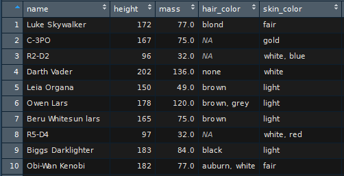
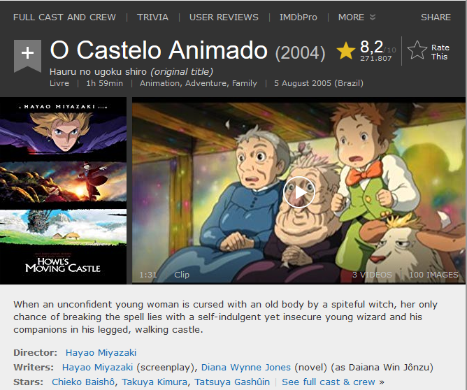
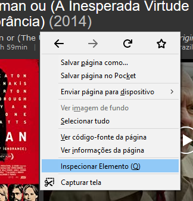
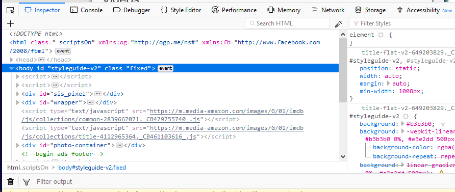
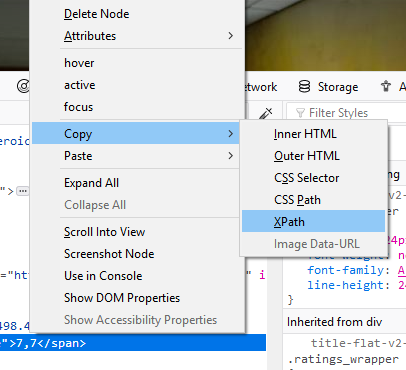
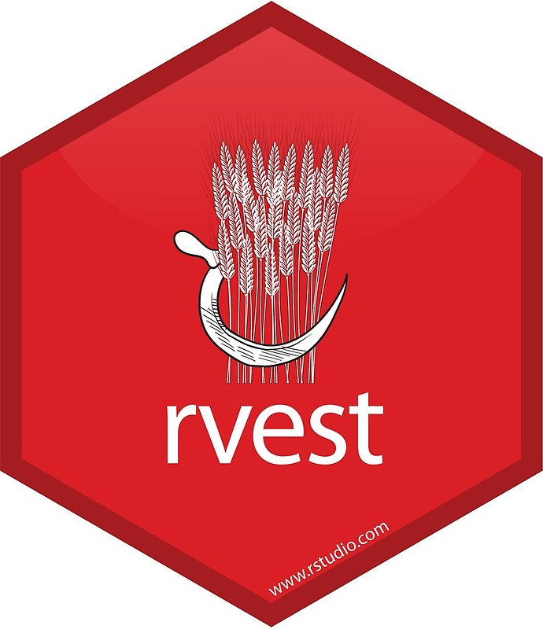
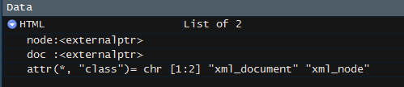

```{r setup, include=FALSE}
knitr::opts_chunk$set(echo = FALSE)
```

## Conteúdo
- Introdução
<br>
- HTML
<br>
- [rvest](https://github.com/hadley/rvest)
<br>
- [RSelenium](https://github.com/ropensci/RSelenium)
<br>
- Encerramento

# Introdução

  + Pacotes
  + O que é webscrapping?

## Pacotes

- Essenciais
    + [rvest](https://github.com/hadley/rvest)
    + [RSelenium](https://github.com/ropensci/RSelenium)
  
- Outros
   + [stringr](https://github.com/tidyverse/stringr)
   + [dplyr](https://github.com/tidyverse/dplyr)

## O que é webscrapping ?

Webscrapping é uma técnica de coleta online que por meio de processos automatizados realiza uma _raspagem_ (scrapping) de uma página da web, estruturando informações contidas no site.

<div class="columns-2" class="centered">
```{r echo=FALSE, out.height = '200x', fig.cap = 'Dados estruturados'}

```

```{r echo=FALSE, out.height = '280px', fig.cap = 'Dados não estruturados'}

```
</div>

# HTML

## Estruturas
- [Tags](https://html.com/tags/)
    + título: `<title> ... </title>`  
    + parágrafo de texto: `<p> ... </p>`  
    + blocos: `<div> ... </div>`
    + tabela: `<table> ... </table>`  
    + hiperlink (âncora): `<a> ... </a>`
<br>
- Class
    + exemplo: `<p class = 'CLASSE'> ... </p>`  
<br>
- ID
    + exemplo: `<p id = 'ID'> ... </p>`  

## Inspecionar Elemento

Podemos inspecionar os elementos de uma página clicando com o botão direito do mouse e acessando a opção **Inspecionar Elemento**.

```{r echo=FALSE, out.height = '280px', fig.align = 'center'}

```

## Inspeção

A seguinte janela aparecerá.

```{r echo=FALSE, out.height = '280px', fig.align = 'center'}

```

## xpath

O xpath assim como tag, class e id é uma forma de localizar elementos de uma página da web.  
<br>
Em **Inspecionar Elemento** clique com o botão direito na parte desejada e selecione
`copiar -> xpath` (pode variar de navegador para navegador).

```{r echo=FALSE, out.height = '255px', fig.align = 'center', fig.cap = 'Copiando o xpath de um node'}

```

## Vantagens e desvantagens{.flexbox}

- Vantagens
    + Fácil utilização
    + As vezes é a única alternativa ou a mais simples.
<br>
- Desvantagens
    + É um endereço fixo, se alguma coisa mudar no site todos eu código pode ser perdido.
    + Não é universal para todos os navegadores.

# Pacotes 

## rvest

<div class="columns-2" class="centered">
Principais funções.

- `read_html()`
- `html_node()`  
- `html_nodes()` 
- `html_text()`  
- `html_attr()`  
- `html_table()` 


```{r echo=FALSE, out.height = '300px', fig.align = 'center'}

```
</div>
## `read_html()`{.vcenter}

A função `read_html()` lê arquivos em html de forma similiar a um `read_csv()`,
que lê arquivos no formato `.csv`.  

-  `HTML <- read_html(https://www.wikipedia.org/)` aqui estamos lendo a página inicial do Wikipedia e armazenando em um objeto.

```{r echo=FALSE, out.height = '155px', fig.align = 'center', fig.cap = 'O seguinte objeto foi criado'}

```

## `html_node()` e `html_nodes()`

Essas funções extraem partes de um arquivo HTML lido com o `read_html()`.
O(s) node(s) que buscamos devem ser passado(s) como uma string, da seguinte forma.  

Vamos supor que ao objeto `HTML` está atribuído um arquivo html usando a função `read_html()`.

<br>
- `html_node(HTML, 'a')`, extrai apenas uma parte com a tag `a`.  
<br>
- `html_nodes(HTML, '.title')`, extrai todas as partes que possuem a class `title`, em caso de class devemos colocar `.` antes do nome da classe.  
<br>
- `html_node(HTML, #price)`, extrai apenas uma parte com o id `price`, em caso de id devemos colocar `#` antes do nome do id.  

##{.flexbox .vcenter}

Podemos ainda buscar por mais de uma parte, exemplo:  
<br>
- `html_node(HTML, '.price li')`, estamos extraindo apenas uma parte com a tag `li` que esta "dentro" da class `price`.  

## `html_text()`, `html_attr()` e `html_table()`

Esse conjunto de funções nos permite efitivamente coletar as informções dos nodes.

  + `html_text()` coleta o texto daquele node.
  + `html_attr()` coleta um atributo do node, por exemplo `href`.
  + `html_table()` coleta uma tabela.

# Exercício

## Exercício

Com o que vimos até agora faça uma coleta simples no site do [IMDB](https://www.imdb.com/) de algum filme que queira e colete as seguintes informações:  
  
  + Título
  + Sinopse
  + Ano
  + Avaliação
  + Link para a imagem do poster. Dica: use a função `html_attr()`

## RSelenium
<div class="columns-2" class="centered">
Principais funções.

- `navigate()`
- `goBack()`
- `goForward()`
- `refresh()`
- `findElement()`
- `findElements()`
- `highlightElement()`
- `clickElement()`
- `sendKeysToElement()`

```{r echo=FALSE, out.height = '250px', fig.align = 'center'}
knitr::include_graphics("../../src/img/selenium.png")
```
</div>