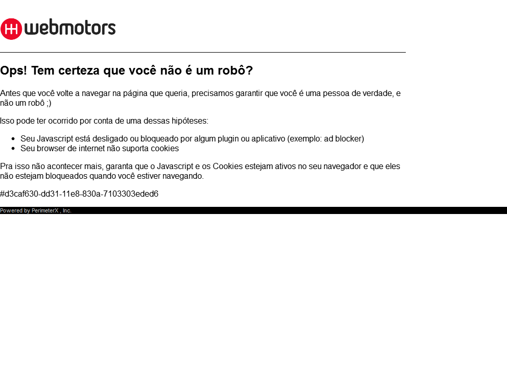

<style>
aside.gdbar img {
  width: 128px;
  height: 66px;
  position: absolute;
  right: 0;
  margin: 15px 15px;
}
</style>

```{r setup, include=FALSE}
knitr::opts_chunk$set(echo = FALSE)
```

## Conteúdo
- Introdução
<br>
- HTML
<br>
- [rvest](https://github.com/hadley/rvest)
<br>
- [RSelenium](https://github.com/ropensci/RSelenium)
<br>
- Encerramento

# Introdução

  + Pacotes
  + O que é webscrapping?

## Pacotes

- Essenciais
    + [rvest](https://github.com/hadley/rvest)
    + [RSelenium](https://github.com/ropensci/RSelenium)
  
- Outros
    + [stringr](https://github.com/tidyverse/stringr)
    + [dplyr](https://github.com/tidyverse/dplyr)
   
<br>
<small>A documentação dos pacotes encontra-se na pasta da apresentação.</small>

## O que é webscrapping ?

Webscrapping é uma técnica de coleta online que por meio de processos automatizados realiza uma _raspagem_ (scrapping) de uma página da web, estruturando informações contidas no site.

<div class="columns-2" class="centered">
```{r echo=FALSE, out.height = '200x', fig.cap = 'Dados estruturados'}
knitr::include_graphics("../../src/img/estructured.png")
```

```{r echo=FALSE, out.height = '280px', fig.cap = 'Dados não estruturados'}

```
</div>

# HTML

  + Estruturas (nodes)
  + Inspecionar Elemento
  + xpath

## Estruturas (nodes)
- [Tags](https://html.com/tags/)
    + título: `<title> ... </title>`  
    + parágrafo de texto: `<p> ... </p>`  
    + blocos: `<div> ... </div>`
    + tabela: `<table> ... </table>`  
    + hiperlink (âncora): `<a> ... </a>`
<br>
- Class
    + exemplo: `<p class = 'CLASSE'> ... </p>`  
<br>
- ID
    + exemplo: `<p id = 'ID'> ... </p>`  

## Inspecionar Elemento

Podemos inspecionar os elementos de uma página clicando com o botão direito do mouse e acessando a opção **Inspecionar Elemento**.

```{r echo=FALSE, out.height = '280px', fig.align = 'center'}

```

## Inspeção

A seguinte janela aparecerá.

```{r echo=FALSE, out.height = '280px', fig.align = 'center'}

```

## xpath

O xpath assim como tag, class e id é uma forma de localizar elementos de uma página da web.  
<br>
Em **Inspecionar Elemento** clique com o botão direito na parte desejada e selecione
`copiar -> xpath` (pode variar de navegador para navegador).

```{r echo=FALSE, out.height = '255px', fig.align = 'center', fig.cap = 'Copiando o xpath de um node'}

```

## Vantagens e desvantagens{.flexbox}

- Vantagens
    + Fácil utilização
    + As vezes é a única alternativa ou a mais simples.
<br>
- Desvantagens
    + É um endereço fixo, se alguma coisa mudar no site todos eu código pode ser perdido.
    + Não é universal para todos os navegadores.

# Pacotes 

  + rvest
  + RSelenium
  
## rvest

<div class="columns-2" class="centered">
Principais funções.

- `read_html()`
- `html_node()`  
- `html_nodes()` 
- `html_text()`  
- `html_attr()`  
- `html_table()` 

```{r echo=FALSE, out.height = '300px', fig.align = 'center'}
knitr::include_graphics("../../src/img/rvest.png")
```
</div>

## `read_html()`{.vcenter}

A função `read_html()` lê arquivos em html de forma similiar a um `read_csv()`,
que lê arquivos no formato `.csv`.  

-  `HTML <- read_html(https://www.wikipedia.org/)` aqui estamos lendo a página inicial do Wikipedia e armazenando em um objeto.

```{r echo=FALSE, out.height = '155px', fig.align = 'center', fig.cap = 'O seguinte objeto foi criado'}

```

## `html_node()` e `html_nodes()`

Essas funções extraem partes de um arquivo HTML lido com o `read_html()`.
O(s) node(s) que buscamos devem ser passado(s) como uma string, da seguinte forma.  

Vamos supor que ao objeto `HTML` está atribuído um arquivo html usando a função `read_html()`.

<br>
- `html_node(HTML, 'a')`, extrai apenas uma parte com a tag `a`.  
<br>
- `html_nodes(HTML, '.title')`, extrai todas as partes que possuem a class `title`, em caso de class devemos colocar `.` antes do nome da classe.  
<br>
- `html_node(HTML, #price)`, extrai apenas uma parte com o id `price`, em caso de id devemos colocar `#` antes do nome do id.  

##{.flexbox .vcenter}

Podemos ainda buscar por mais de uma parte, exemplo:  
<br>
- `html_node(HTML, '.price li')`, estamos extraindo apenas uma parte com a tag `li` que esta "dentro" da class `price`.  

## `html_text()`, `html_attr()` e `html_table()`

Esse conjunto de funções nos permite efitivamente coletar as informções dos nodes.

  + `html_text()` coleta o texto daquele node.
  + `html_attr()` coleta um atributo do node, por exemplo `href`.
  + `html_table()` coleta uma tabela.

# Exercício

## Exercício

Com o que vimos até agora faça uma coleta simples no site do [IMDB](https://www.imdb.com/) de algum filme que queira e colete as seguintes informações:  
  
  + Título
  + Sinopse
  + Ano
  + Avaliação
  + Link para a imagem do poster.  
  Dica: use a função `html_attr()`

<small>Tente não usar o xpath.</small>

## RSelenium

<big>**Por que usar o RSelenium?**</big> 
<br>
Nem sempre sites não são feitos apenas em **html**, alguns possuem aplicativos interativos feitos em outras linguagens, como por exemplo **JavaScript**. Assim, precisaremos emular um navegador automatizado para interagir com a página web e coletar as informações desejadas e para isso usaremos o `Selenium`.

## Funções
<div class="columns-2" class="centered">
Principais funções.

- `rsDriver()`
- `navigate()`
- `goBack()`
- `goForward()`
- `refresh()`
- `findElement()`
- `findElements()`
- `clickElement()`
- `sendKeysToElement()`


```{r echo=FALSE, out.height = '250px', fig.align = 'center'}
knitr::include_graphics("../../src/img/selenium.png")
```
</div>

## `rsDriver()` {.small}
Inicia o navegador automatizado, o navegador _default_ é o Chrome mas possuímos 2 outras opções, Firefox e phantomJS.  
<br>
Utilização:  
<br>
- `rD <- rsDriver(browser = 'firefox')` incializa o Firefox e armazena em um objeto.  
- `remDr <- rD$client` remDr é o objeto que será o cliente do servidor, ou seja, ele é responsável por enviar as requisições.  
  
  <small>`remDr` = _Remote Driver_</small>
  
##  `navigate()`, `goBack()`, `goForward()` e `refresh()`
- `navigate()` navega até a url desejada. Utilização.   `remDr$navigate('http://www.google.com.br/')` navega até a página inicial do google.  
- `goBack()` volta para a página anterior do navegador. Utilização, `remDr$goBack()`  
- `goForward()` avança para a página seguinte do navegador. Utilização, `remDr$goForward()`  
- `refresh()` atualiza a página do navegador. Utilização, `remDr$refresh()`  


## `findElement()` e `findElements()`
Essas funções são similares as funções `html_node()` e `html_nodes()`, respectivamente.  
<br>
Argumentos:  
<br>
- `using` devemos passar o que iremos usar para a função encontrar o elemento. Valores possíveis: `class name`, `name`, `xpath`, `id`, `css selector`, `tag name` e `link text`.  
<br>
- `value` os valores do que estamos procurando.  
<br>
Utilização:  
```r 
remDr$findElement(using = 'class name', value = 'price')
```
## `clickElement()` e `sendKeysToElement()`

FALTA SÓ ESSE AQUI EIN NÃO VAI ESQUECER

# Encerramento

  + robots.txt
  + Ética e boas práticas
  + Agradecimento
  
## robots.txt

robots.txt é uma forma de sabermos onde o proprietário do site nos permite fazer scrapping. Atualmente, grande parte dos sites já possuem e podemo checar apenas adicionando `/robots.txt` no final da url.  
<br>
Exemplo:
<http://www.amazon.com.br/robots.txt> , ao clicar no link poderemos ver o robots.txt da página da Amazon.

## Ética e boas práticas

- Respeitar o robots.txt
- Não fazer mais de uma consulta por segundo. Basta colocar um `Sys.sleep(1)` no seu código.
- Não ultrapassar o limite de informções coletadas por dia, se evolver. Entretanto, sempre manter o bom senso.

Essas boas práticas evitam que sobrecarreguemos os servidores e cause prejuízo a essas empresas.

## Captcha

```{r echo=FALSE, out.height = '600px', fig.align = 'center'}

```

## Agradecimento

##### Daniel dos Santos

######## Universidade Federal Fluminense

<br>
<br>
<br>
<br>
<br>
<br>
<br>
<br>

[Github](https://www.github.com/Daniel-EST/ws-material/)
